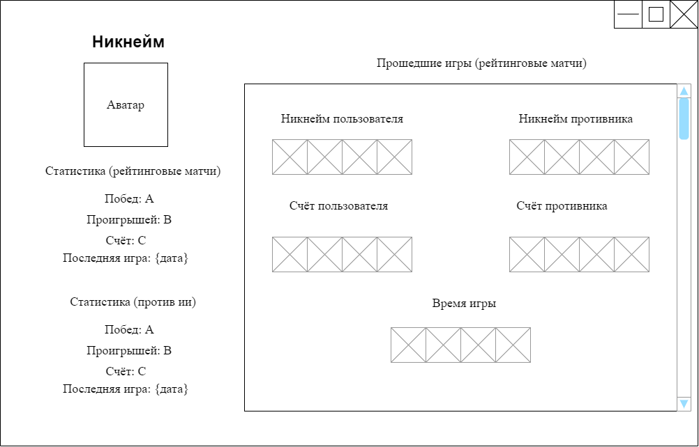
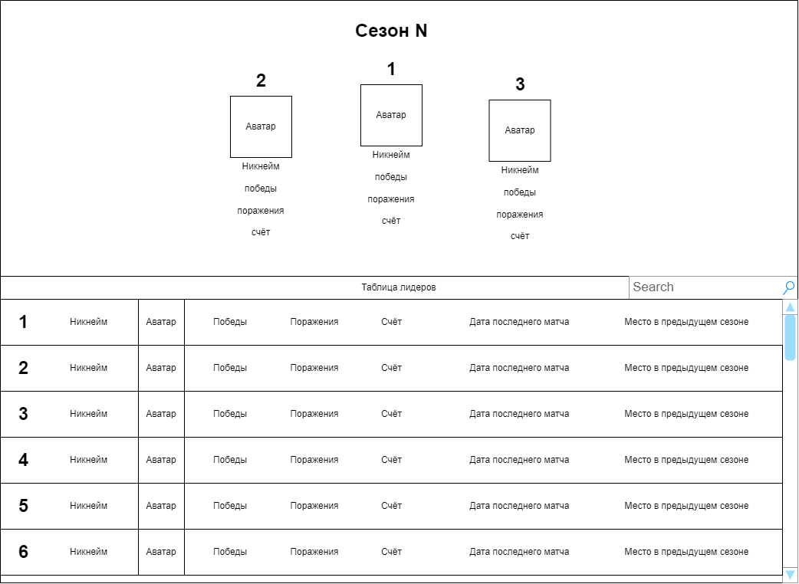
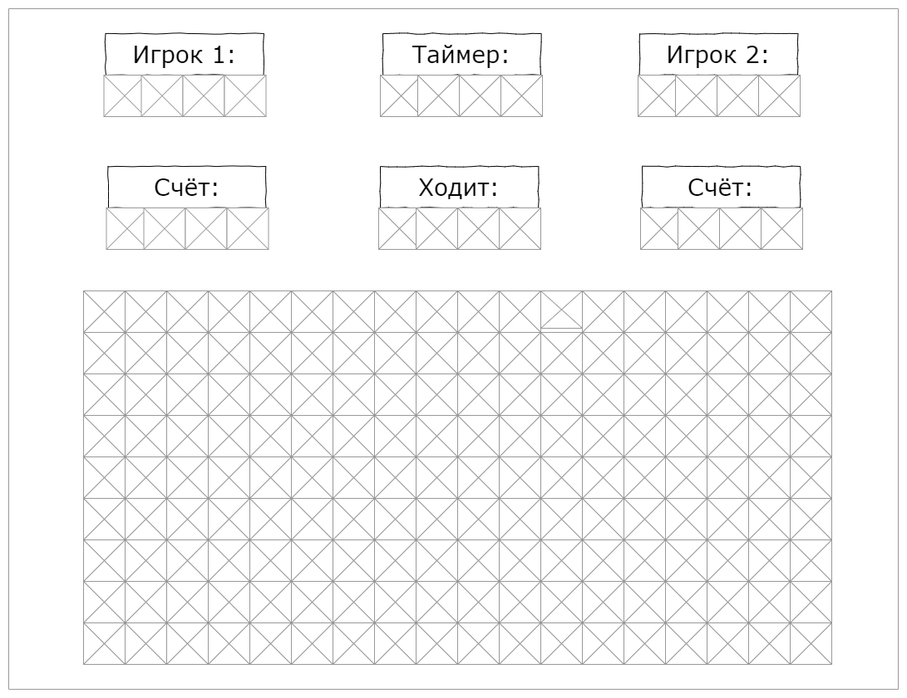
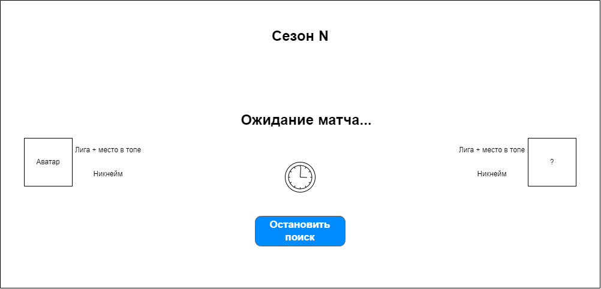

# TRITPO_2
# Требования к проекту

## Введение

### 1.1 Назначение

В этом документе описаны функциональные и нефункциональные требования к приложению "Battle of words". Этот документ предназначен для команды, которая будет реализовывать и проверять корректность работы приложения.

### 1.2 Бизнес требования

#### 1.2.1 Исходные данные

11 февраля 2015 года вышла игра «Филворды. Поиск слов.» – это интеллектуальная игра, где необходимо найти и выделить на поле слова. Буквы каждого слова располагаются друг к другу вертикально и горизонтально. Но в этой игре есть недостатки – нет духа соревнования. С целью устранения этих недостатков было принято решение разработать игру на основе филворда. Игра будет иметь уникальный режим, который позволит соревноваться с другими игроками и будет иметь увлекательный геймплей. Игроки будут так же искать и выделять слова в полях с буквами. Соревнование заключается в том, сколько очков наберут игроки. Очки начисляются за нахождение слов, количество очков зависит от длины слова (прим. слово «привет» имеет вес в 6 очков). Так же будет присутствовать таймер, указывающий сколько времени дано игроку на поиск + выделение слова. Если игрок не успел за это время найти и выделить слово, то будет засчитано, что он пропустил свой ход и наступит ход следующего игрока. Игрока, который начинает первым, система будет выбирать случайным образом. В этот режим можно будет играть и против ии.

#### 1.2.2 Возможности бизнеса

Чтобы проверить знания и навыки поколений, уменьшить пропасть между ними, при этом не убрать интерес соревнования есть возможность создать игру "Battle of words" (битва слов). Такая игра позволяет игрокам проявить свои навыки и знания, посостязаться с другими игроками (прим. родители, дети).

#### 1.2.3 Границы проекта

Программа будет бесплатная с платными функциями. Пользователю необязательно регистрироваться, но предпочтительнее будет иметь аккаунт. 

Для не зарегистрированных пользователей будет доступен классический кроссворд и режим «битва слов» против ии. 

Зарегистрированным пользователем будет доступна их статистика, просмотр своего профиля, возможность вызвать другого игрока на бой, возможность занять место в лиге, возможность создавать и принимать участие в турнирах. 

### 1.3 Аналоги
Конкретно для этой игры аналогов нет.

---

## 2 Требования пользователя

### 2.1 Интерфейс пользователя

окно профиля пользователя 

окно топа пользователей

окно соревнования

окно поиска противника

### 2.2 Характеристики пользователей

#### 2.2.1 Классификация пользователей

**Не зарегистрированные** пользователи - пользователи не создавшие аккаунт, они имеют доступ только к базовому функционалу, который позволяет разгадывать классические кроссворды, а так же играть против ии в режиме битвы, так же подходит для тестирования приложения.

**Зарегистрированные пользователи** - пользователи привязавшие свою почту к приложению. Такие пользователи имеют доступ к своему профилю, где отображается их личная статистика, появляется возможность бросать вызов другим игрокам, открывается доступ к рейтинговым состязаниям. Так же пользователь может участвовать в турнирах, которые могут организовываться другими игроками. Пользователь может организовать и свой личный турнир.

#### 2.2.2 Целевая аудитория

Люди всех возрастов, решившие показать/проверить свои знания.

### 2.3 Предположения и зависимости

1. Программа должна быть кроссплатформенной.
2. Должна быть хорошая защита по отношению проверки на подписку к платным услугам.

---

## 3 Системные требования

### 3.1 Функциональный требования

#### 3.1.1 Приложение от лица не зарегистрированного пользователя

 * Пользователь при входе в программу получает уведомление о том, что не имеет аккаунта 
 * Если пользователь не решается создать аккаунт, то ему открывается окно с базовым функционалом, где он может протестировать режим «битва слов» (играя против искусственного интеллекта) или разгадать классические кроссворды.

#### 3.1.2 Приложение от лица зарегистрированного пользователя

 * При входе пользователю открывается окно с его профилем с доступными вкладками: топ игроков, друзья, рейтинговые матчи, игра с другом, турниры, игра против ии, классические кроссворды.
 * Топ игроков открывает окно где отображаются чемпионы за всё время и лидеры в текущем сезоне, так же пользователь может увидеть свое место в мировом рейтинге, так же можно увидеть локальный рейтинг (вашего региона).
* Игра с другом позволяет сразиться с другом из списка друзей или с пользователем id которого будет введен. Победа/поражение не влияет на позицию в рейтинге.
* Во вкладке турниры можно организовать свой турнир или принять участие в уже подготовленном другим пользователем. Победа/поражение не влияет на позицию в рейтинге. 
* Рейтинговые матчи делятся на глобальные и локальные (региональные). Пользователь играет в режим «битва слов» против подобранного игрока из той же лиги. Победы/поражения влияют на позицию в рейтинге.  Доступен платный приоритетный поиск.
* Игра против ии - пользователь играет против искусственного интеллекта. Можно выбрать сложность ии, матч начинается сразу, идет отдельный учет побед/поражений, который можно посмотреть в профиле. Победа/поражение не влияет на позицию в рейтинге.
* Во вкладке классические кроссворды пользователь разгадывает обычный (классический) кроссворд. Нет лимитов по времени, есть возможность поставить рекордное время.
* Во вкладке друзья можно просмотреть список друзей, узнать свой id, добавить в друзья. 

#### 3.1.3 Система подбора противников

Каждый месяц объявляется новый игровой сезон при котором глобальный топ обнуляется, но при этом личная статистика пользователей не стирается. При сбросе глобальной статистики нужно учитывать очки "поощрения" в выдаче новой лиги. Лига - промежуточные уровни которые созданы для разделения более сильных игроков от более слабых, прим: Знаток - самые сильные игроки, Учитель - средняя лига, Ученик - начальная лига. В зависимости от очков поощрения зависит в какую именно лигу попадет игрок после завершения сезона, сделано это для того чтобы сильнейшие игроки не тратили время и не портили настроение другим игрокам побеждая их своим опытом сражений.

После нажатия пользователем на кнопку поиска, он попадает в окно поиска противника, если пользователь купил подписку приоритетного поиска, то он должен обладать особым приоритетом подбора игроков. Изначально подбираются игроки среди той же лиги в которой находится пользователь, спустя 30 секунд после поиска, поиск расширяется до нижней лиги (при том условии, что оппонент победил более чем в 10 поединках), спустя еще 30 секунд поиск начинает работать по всем лигам.

Так же можно настроить поиск для игры с противниками только из вашего региона, в целом он совпадает с глобальным поиском за исключением масштаба поиска.

Если пользователь досрочно покидает игру (более 3 раз), его приоритет поиска становится чуть ниже. Восстановить приоритет можно путем отыгрывания полных игр (количество игр которое нужно сыграть для восстановления приоритета = количеству покинутых игр). Если пользователь с купленной подпиской на приоритетный поиск досрочно покидает 2 игры, то он получает предупреждении о возможном снятии приоритетного поиска, если после этого пользователь покидает еще одну игру, то приоритетный поиск снимается и доступ на покупку блокируется на неделю.

Работа приоритета поиска заключается в том, что в первую очередь противники должны подбираться для людей с особым приоритетом, во вторую с обычным и в третью с низким приоритетом. Во время поиска нужно уведомлять пользователя каким именно приоритетом поиска он обладает и причину (прим. Куплена подписка).

В случае если игрок использует обычный поиск (не соревновательный) то поиск идёт совершенно свободно (нашелся - начал играть).

#### 3.1.4 Система блокировок

Пользователи находящиеся под [VAC баном](https://steamcommunity.com/sharedfiles/filedetails/?id=607854175) изначально имеют низкий приоритет поиска, но у них нет запрета на повышение приоритета своего поиска. Если пользователь подозревается в читерстве, подставных боях или в нарочном краше сервера в целях досрочный завершения игры без потери рейтинга, то такой пользователь может получить ограничение на поиск новых боев от пары дней вплоть до полной блокировки. Заблокированные пользователи получают статус *Blocked* с причиной в описании их профиля.

### 3.2 Нефункциональные требования

#### 3.2.1 Визуальный стиль

Визуальный стиль приложения должен быть приближен к атмосфере игр Crossword Explorer, «Филворды. Поиск слов.» (возможны свои доработки/добавления).

#### 3.2.2 Требования к удобству

Глобальная статистика должна обновляться каждые 20 минут или если пользователь завершил матч с противником.

#### 3.2.3 Ограничения

1. Язык программирования С++17.
2. Ui пишется в Qt версии 6.0.3.
3. База данных PostgreSQL.
4. Язык приложения русский и английский, в будущем оставить возможность добавлять новые переводы для программы.
